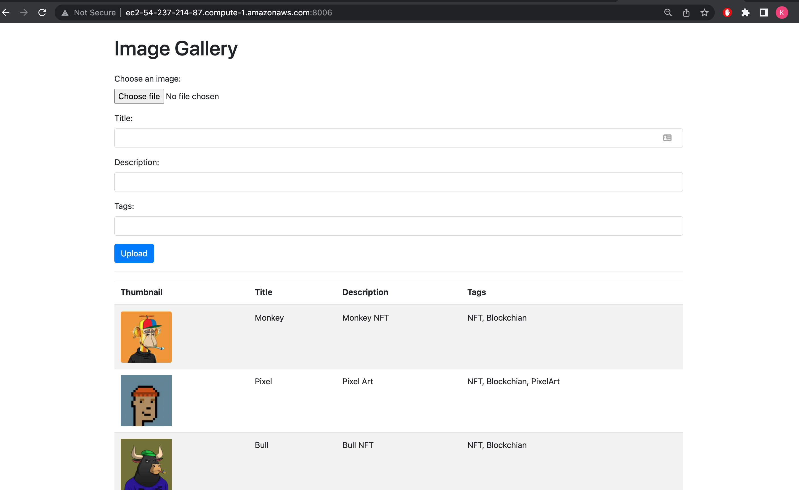
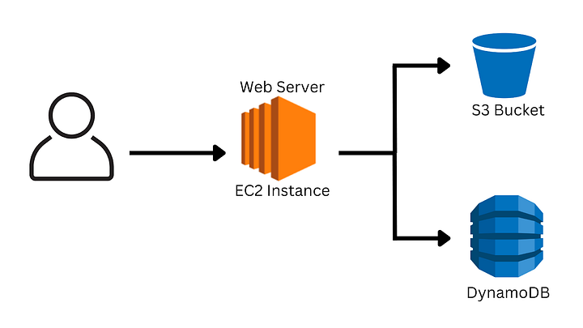

# ImageGallery-fastapi

## Summary
A simple image gallery web via Fast-api with local S3 & Dynamodb. 

The objective of the project is to test a web app locally in a simulated environment like on AWS. Next, all necessary resoruces will be created via AWS Cloudformation. The dockerized web app will be run in an EC2 instance connected to Dyanmo & S3. 

As a developer, testing apps locally in a simulated environment like AWS can be useful in shortening deployment time. Deploying apps to cloud platforms can often require separate deployment teams, so it’s crucial for developers to have a reliable local testing environment.

This is where the ImageGallery-fastapi app comes in handy. The app is a simple image gallery web application with local S3 and DynamoDB. You can follow the structure to develop your own apps easily! =]





## TL;DW
1. Make sure you have setup $HOME/.aws/credentials. It can be just a dumpy credential locally

2. Run the app locally with docker-compose. Remember to shutdown servcies before each rerun e.g 
```
docker-compose down
docker-compose up
```
Now, you can visit the web app on localhost:8006 from your browser! 

3. After each modificaiton on the app. Build the image again and repeat the step 2 e.g
```
docker build --no-cache -t kennedydocker/gallery_fast_api:latest .
```

To follow the same structure for your own apps, you can modify the gallery_fast_api service in the docker-compose.yml e.g replace the image repo with your own one.

## Setup local dyanmodb, s3 and fast-api app individually 
### Setup local dyanmodb. 
Files will be written to memory only. Table content can be reviewed via a local dynamodb-admin gui
```
docker run -d -p 8000:8000 --name local-dynamodb amazon/dynamodb-local
docker logs -f local-dynamodb
npm install -g dynamodb-admin
dynamodb-admin
```
Then visit http://localhost:8001/ to visit check the dynamodb at the admin portal

REF:

https://hub.docker.com/r/amazon/dynamodb-local
https://docs.aws.amazon.com/amazondynamodb/latest/developerguide/DynamoDBLocal.UsageNotes.html

### Setup local s3
```
docker run -p 9090:9090 -p 9191:9191 -e initialBuckets=test -e debug=true -t adobe/s3mock
```
REF:

https://github.com/adobe/S3Mock

### Setup the fast-api app without docker. 
This can useful, since --network host may not work in your machine during testing
```
uvicorn main:app --port 8006 --reload 
```

Alernatively, run it with docker on non-mac machine.  --network host can be used. As mentioned, configure your $HOME/.aws/credentials, so that it can be binded to the container
```
docker build -t kennedydocker/gallery_fast_api:latest .
docker run --network host  -e ENV_NAME=development -e ORI_IMAGES_BUCKET=oriimagesbucket7566 -e RESIZED_IMAGES_BUCKET=resizedimagesbucket7566 -e DYANMODB_TABLE_NAME=image_meta --mount type=bind,source=$HOME/.aws,target=/root/.aws,readonly kennedydocker/gallery_fast_api:latest
```

With the above instructions, you should be able to run the app locally. Enjoy testing with the app locally!!

##  AWS production deployment
### The cloudformation stack will be in another repo.

### publish it to dockerhub e.g
```
docker build --no-cache -t kennedydocker/gallery_fast_api:latest .
docker push kennedydocker/gallery_fast_api:latest
```

### AWS setup
Prerequisite
1. create s3 buckets with appropriate policies and rules
2. create dynamodb table with appropriate essential policies and rules
3. create cloudformation stack

The setup script is actually recorded in UserData in cloudformation stack. FYI, on EC2, you can run the following:
```
docker run -e ENV_NAME=production -e ORI_IMAGES_BUCKET=oriimagesbucket7566 -e RESIZED_IMAGES_BUCKET=resizedimagesbucket7566 -e DYANMODB_TABLE_NAME=image_meta -p 8006:8006 kennedydocker/gallery_fast_api:latest
```

